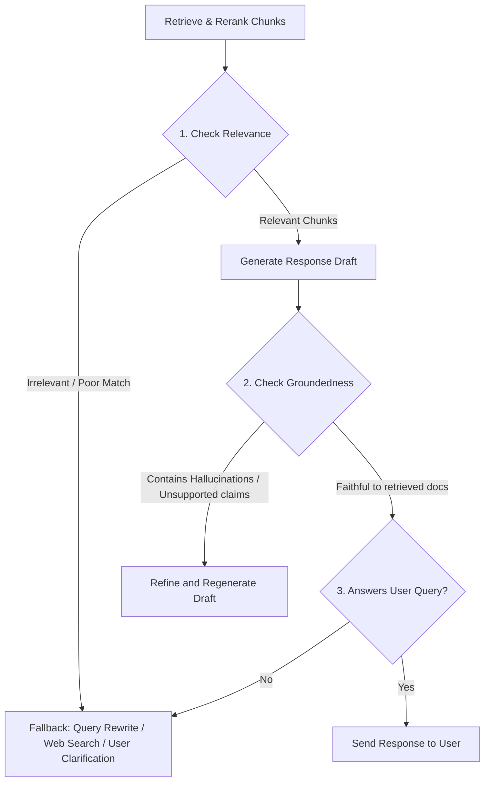

# Agentic RAG System: Architecture Blueprint & Bulletproofing Guide

This document outlines the detailed system design, critiques, and implementation strategies for building a production-grade, stateful **Agentic RAG Agent**. The architecture integrates multi-query retrieval, ColBERT/Cross-encoder reranking, multi-modal extraction, dynamic tool execution, a self-reflection loop, and an asynchronous Temporal-driven memory consolidation workflow.

---

## 1. System Architecture

The agent is designed as a state-based loop (similar to a cognitive agent architecture like CoALA) rather than a simple sequential chain. 

---

## 2. Multi-Tiered Memory System

To achieve persistent, human-like contextual awareness without inflating the LLM's active context window, we split memory into three components:

1. **Working Memory (Context Window):** The immediate conversation history (last 5–10 messages) plus retrieved documents and relevant profile vectors.
2. **Episodic Memory (Experiences):** Structured, time-stamped summaries of previous sessions and events (e.g., *"On July 12, user purchased 5 bags of Cattle Feed X and requested express delivery due to drought"*).
3. **Semantic Memory (Personal Knowledge Base):** General facts about the user and their entities extracted over time (e.g., `user_cows_count = 50`, `preferred_medicine_brand = 'Pfizer Animal Health'`, `delivery_address = '123 Farm Road'`).

### Asynchronous Memory Consolidation via Temporal

To avoid blocking the synchronous chat execution path, memory synthesis is handled by a background Temporal workflow.

#### Execution Trigger Strategy
* **Event-based:** Triggered when a chat session closes, or when a user reaches a threshold of messages/tokens.
* **Temporal Schedule:** Every *n* minutes, a background worker sweeps inactive sessions to extract facts.

#### Workflow Definition (`src/app/temporal/memory_workflows.py`)

```python
import json
from datetime import timedelta
from temporalio import workflow
from temporalio.common import RetryPolicy

# Import activities
with workflow.unsafe.imports_passed_through():
    from src.app.temporal.memory_activities import (
        fetch_raw_chat_logs,
        run_semantic_extraction,
        run_episodic_summarization,
        save_consolidated_memories,
    )

@workflow.defn
class MemoryConsolidationWorkflow:
    @workflow.run
    async def run(self, user_id: str, session_id: str) -> dict:
        """
        Orchestrates memory consolidation: reads recent conversation,
        extracts new semantic facts & builds a chronological episode summary,
        then updates Redis/Database.
        """
        # Step 1: Fetch raw message lists from the last N interactions
        chat_logs = await workflow.execute_activity(
            fetch_raw_chat_logs,
            args=[user_id, session_id],
            schedule_to_close_timeout=timedelta(seconds=60),
            retry_policy=RetryPolicy(maximum_attempts=3)
        )
        
        if not chat_logs or len(chat_logs) < 2:
            return {"status": "skipped", "reason": "Insufficient chat logs"}

        # Step 2: Asynchronously run LLM-based semantic fact extraction & episodic summarization
        semantic_facts = await workflow.execute_activity(
            run_semantic_extraction,
            args=[user_id, chat_logs],
            schedule_to_close_timeout=timedelta(minutes=2),
            retry_policy=RetryPolicy(maximum_attempts=2)
        )
        
        episodic_summary = await workflow.execute_activity(
            run_episodic_summarization,
            args=[user_id, chat_logs],
            schedule_to_close_timeout=timedelta(minutes=2),
            retry_policy=RetryPolicy(maximum_attempts=2)
        )

        # Step 3: Write consolidated values to Redis/Database
        result = await workflow.execute_activity(
            save_consolidated_memories,
            args=[user_id, semantic_facts, episodic_summary],
            schedule_to_close_timeout=timedelta(seconds=30),
            retry_policy=RetryPolicy(maximum_attempts=5)
        )
        
        return {"status": "completed", "details": result}
```

#### Memory Structure (Saved in Upstash Redis/Postgres)
* **User Profile (Semantic Hash):**
  ```json
  {
    "user_id": "usr_90210",
    "animals": {
      "cattle": 45,
      "goats": 12
    },
    "location": "North Punjab Region",
    "delivery_pref": "Express Cargo",
    "restrictions": ["sensitive to copper-based supplements"]
  }
  ```
* **Episodic Vectors (Pinecone Namespace `episodic-memory`):**
  * Vector ID: `usr_90210#episode_2026_07_12`
  * Text Payload: *"User placed booking for Bovine Growth supplement. Expressed concern about product shelf-life under monsoon humidity. Resolved by agent recommending dry storage bags."*
  * Metadata: `{"user_id": "usr_90210", "timestamp": 1783857600}`

---

## 3. Query Optimization & Retrieval Stack

To ensure that the sales agent recommends the *correct* feed/dosage, retrieval must match context, synonyms, and language variations.

### Step 1: Query Re-writing & Multi-Query Generation
Users may ask questions containing pronouns (*"how much of it should I give them?"*) or vague terms. The re-writer resolves co-references and translates conversational sentences into search vectors.

```python
from typing import List
from openai import OpenAI

class QueryOptimizer:
    def __init__(self, client: OpenAI):
        self.client = client

    def optimize(self, conversation_history: List[dict], current_query: str) -> List[str]:
        """
        1. Re-writes conversational query to a stand-alone retrieval query.
        2. Generates 3 semantic variations (Multi-Query) to overcome vector alignment issues.
        """
        history_str = "\n".join([f"{m['role']}: {m['content']}" for m in conversation_history[-5:]])
        
        prompt = f"""
        Given the conversation history and a final user question, do the following:
        1. Resolve pronouns (e.g. 'it', 'them', 'this feed') using the history context.
        2. Generate 3 unique search queries that cover different semantic aspects of the user's intent.
        
        History:
        {history_str}
        
        User Question: {current_query}
        
        Output format: Return ONLY a JSON list of strings.
        Example: ["query 1", "query 2", "query 3"]
        """
        
        response = self.client.chat.completions.create(
            model="gpt-4o-mini",
            response_format={"type": "json_object"},
            messages=[{"role": "user", "content": prompt}],
            temperature=0.0
        )
        
        try:
            queries = json.loads(response.choices[0].message.content)
            # Ensure it is a list
            return queries if isinstance(queries, list) else [current_query]
        except Exception:
            return [current_query]
```

### Step 2: Funnel Retrieval (Pinecone Hybrid + Jina Rerank)
* **Stage 1 (Hybrid Search):** Query Pinecone with dense embeddings (for semantic alignment) + sparse TF vectors (for exact keyword names like "Bovatec-20", "Dewormer Plus"). Run in parallel for the generated multi-queries.
* **Stage 2 (De-duplication):** Combine and de-duplicate matches by `chunk_id`.
* **Stage 3 (Jina Reranker):** Send raw chunks to Jina Reranker endpoint (`https://api.jina.ai/v1/rerank`). Reranking uses cross-encoder evaluation to select the best 3 chunks, ensuring accurate dosage and product specs are presented to the LLM.

```python
import httpx

async def rerank_documents(query: str, documents: List[dict], api_key: str, top_n: int = 4) -> List[dict]:
    """
    Reranks document chunks using Jina Rerank V2 API.
    """
    if not documents:
        return []
        
    url = "https://api.jina.ai/v1/rerank"
    headers = {
        "Authorization": f"Bearer {api_key}",
        "Content-Type": "application/json"
    }
    
    docs_payload = [doc["text"] for doc in documents]
    payload = {
        "model": "jina-reranker-v2-base-multilingual",
        "query": query,
        "documents": docs_payload,
        "top_n": top_n
    }
    
    async with httpx.AsyncClient(timeout=10.0) as client:
        response = await client.post(url, headers=headers, json=payload)
        if response.status_code != 200:
            logger.error(f"Reranking failed: {response.text}. Returning original top K.")
            return documents[:top_n]
            
        results = response.json().get("results", [])
        reranked_docs = []
        for res in results:
            idx = res["index"]
            original_doc = documents[idx]
            original_doc["rerank_score"] = res["relevance_score"]
            reranked_docs.append(original_doc)
            
        return reranked_docs
```

---

## 4. Self-Reflection & Feedback Loop (Self-RAG)

To act as a safe sales agent (avoiding incorrect medical dosage claims), the agent utilizes a **Corrective RAG (CRAG) / Self-RAG** logic flow before responding:



### Self-Reflection Evaluators
1. **Relevance Evaluator:** Assess whether the retrieved snippets actually address the topic of the query. If a user asks about *footrot medicine* and retrieved chunks talk about *milking machines*, trigger a fallback (either search web, search another namespace, or notify the user of catalog limitations).
2. **Groundedness Evaluator (Anti-Hallucination):** Compares the LLM generated response against retrieved chunks. If the response recommends a dosage of `10ml` but the retrieved text specifies `5ml`, the evaluator flags it as a hallucination, prompting re-generation.
3. **Response Completeness Evaluator:** Verifies if all aspects of the user query were addressed (e.g., did we answer both "Is it safe for pregnant cows?" AND "What is the price?").

---

## 5. Multimodal Ingest (Image/PDF) Pipeline

When a user uploads a diagnostics image (e.g., infected livestock skin, medical prescription, product label) or PDF, we must feed this semantic evidence to the agent.

```python
class MultimodalExtractor:
    def __init__(self, openai_client: OpenAI):
        self.openai = openai_client

    async def extract_visual_context(self, file_path: str) -> str:
        """
        Uses a vision model to convert images/scans to highly descriptive text
        so it can be indexed or passed directly to the Agentic RAG core.
        """
        import base64
        
        with open(file_path, "rb") as image_file:
            encoded_image = base64.b64encode(image_file.read()).decode('utf-8')
            
        prompt = """
        Analyze this image uploaded by the user. 
        Extract and describe in detail:
        1. Any printed/handwritten text, product labels, ingredient lists, or medical prescriptions.
        2. Visual observations (e.g. animal appearance, rashes, physical state, packaging condition).
        3. Formulate a summary that can be used by an AI Veterinarian/Sales assistant to guide the user.
        """
        
        response = self.openai.chat.completions.create(
            model="gpt-4o",
            messages=[
                {
                    "role": "user",
                    "content": [
                        {"type": "text", "text": prompt},
                        {"type": "image_url", "image_url": {"url": f"data:image/jpeg;base64,{encoded_image}"}}
                    ]
                }
            ]
        )
        return response.choices[0].message.content
```

---

## 6. Agentic Tool Calling & Integration

The agent acts as a stateful orchestrator with access to deterministic tools:

```python
from langchain_core.tools import tool

@tool
def get_delivery_status(order_id: str) -> str:
    """Retrieves real-time shipping progress, courier info, and ETA for a specific order."""
    # Queries the actual logistics API (or Redis status manager)
    return status_manager.get_job_status(order_id)

@tool
def create_booking(user_id: str, product_sku: str, quantity: int, address: str) -> dict:
    """Places a new product reservation/booking in the system and returns confirmation details."""
    # Executes internal transactional endpoint
    booking_id = f"BK-{uuid.uuid4().hex[:6].upper()}"
    return {
        "booking_id": booking_id,
        "status": "confirmed",
        "message": f"Successfully reserved {quantity} units of {product_sku}."
    }

@tool
def suggest_feeds_and_medicine(animal_type: str, symptoms: List[str]) -> str:
    """Retrieves product recommendations and official veterinary guides for specific symptoms."""
    # Runs the optimized RAG search (multi-query + rerank) inside the company's vector index
    return query_rag_engine(f"Feed and medicine recommendations for {animal_type} with {', '.join(symptoms)}")
```

---

## 7. Critical Mistakes in Naive Designs & How to Bullet-Proof Them

### ❌ Mistake 1: Blocking Synchroneous Execution on Memory Synthesizer
* **Issue:** Generating semantic summaries and updating Pinecone embeddings during a live chat HTTP request introduces 3–10 seconds of latency, killing the user experience.
* **🛡️ Bulletproofing:** Use a background queue. The FastAPI server immediately returns the response to the user. A Redis pubsub event triggers a Temporal Workflow, running memory consolidation in isolation.

### ❌ Mistake 2: Embedding Drift and Outdated Facts in Long-term Memory
* **Issue:** Episodic facts pile up, leading to contradictory data (e.g. User states: *"I have 10 cows"* in Session 1, and *"I have 15 cows"* in Session 4. Both get retrieved, causing LLM confusion).
* **🛡️ Bulletproofing:** 
  1. Implement **Temporal Validity Tags** on episodic facts: `{"valid_since": 1783857600, "is_active": true}`.
  2. The background Memory Worker must perform **Entity Deduplication** (re-running LLM synthesis to merge/update facts rather than appending endlessly).

### ❌ Mistake 3: Dosage Hallucinations (Liability & Compliance Risk)
* **Issue:** The LLM hallucinates dosage values (e.g., recommending a double dosage for animals, which could lead to toxic reactions or death, posing severe legal risks to the company).
* **🛡️ Bulletproofing:**
  1. **Strict Guardrails:** Execute code-level constraint checking. If a dosage advice is output, a parser regex extracts the numerical metrics and asserts against a database of verified product metadata limits.
  2. **Zero-Hallucination Prompting:** Use System Instruction directives: *"If the exact dosage is not found in the context, output: 'I cannot verify the dosage for this product. Please consult our official manual or a veterinarian.' Do not extrapolate."*

### ❌ Mistake 4: Missing Context on PDF Extraction
* **Issue:** Fallback parsing (e.g., basic `PyMuPDF`) loses tables, layout relationships, and image diagrams. Dosage instructions are frequently printed inside tables, which look like gibberish when flattened.
* **🛡️ Bulletproofing:** Ensure LlamaParse is the primary extraction engine. If it fails, routing to GPT-4o-mini Vision to transcribe PDF pages as images maintains tables and tabular structures intact.

### ❌ Mistake 5: LLM Loop/Infinity Tool Calls
* **Issue:** In an agentic loop, the LLM keeps invoking `suggest_feeds_and_medicine` endlessly with slightly different variations when it cannot find a perfect match.
* **🛡️ Bulletproofing:** Wrap tool calling in a circuit breaker. Restrict the maximum loop iterations in the LangGraph state (e.g., `max_iterations = 4`). Once exceeded, fall back to a human agent handover or default customer support notification.

---

## 8. Development Roadmap & Tasks

To implement the above features in our existing codebase:
- [ ] **Task 1:** Create `src/app/services/memory_service.py` to handle episodic summaries and user profile storage in Upstash Redis.
- [ ] **Task 2:** Add Temporal workflow `MemoryConsolidationWorkflow` inside `src/app/temporal/workflows.py` to run asynchronously.
- [ ] **Task 3:** Create `src/app/services/reranking_service.py` using Jina / Cohere API to implement the second-stage retrieval funnel.
- [ ] **Task 4:** Rewrite the query pipeline in `src/app/services/query_pipeline.py` supporting query-rewriting, multi-querying, and self-reflection checks.
- [ ] **Task 5:** Expose agent endpoints `/v1/chat` and `/v1/chat/stream` in FastAPI.
