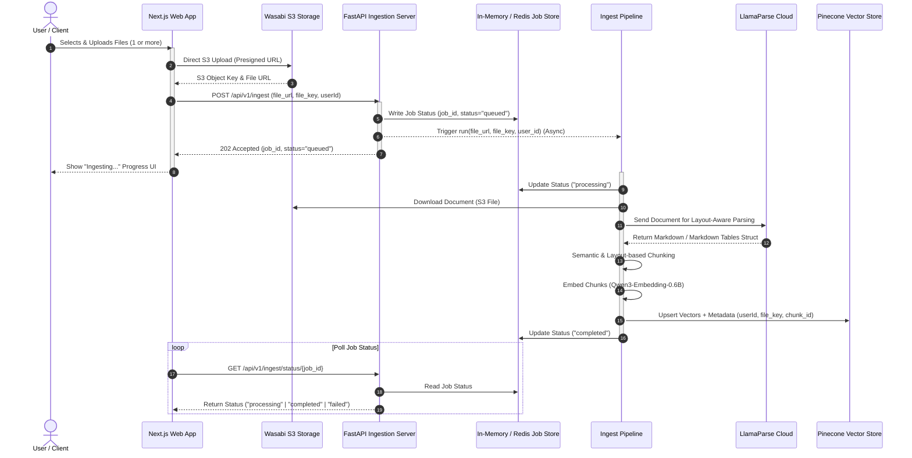

# Document Ingestion Pipeline Architecture & Request Flow

This document details the architecture, request life cycle, and workflow patterns of the asynchronous document ingestion pipeline for the Customer Ingestion Agent.

---

## 1. Request Flow Overview

The ingestion pipeline handles file uploads, parsing, chunking, embedding generation, and vector database indexing. Because processing documents (especially large PDFs) is a long-running, CPU/Network-heavy task, it runs asynchronously.

Here is the step-by-step request flow:

---

## 2. In-Depth Component Analysis

### A. Client Side (Next.js Application)
* **Responsibility**: Direct file upload to Wasabi S3 via presigned URLs (to avoid uploading files through the FastAPI server, which saves server bandwidth and memory).
* **Job Polling**: Upon successful S3 upload, the client triggers the FastAPI `/api/v1/ingest` endpoint and receives a unique `job_id`. It then polls `/api/v1/ingest/status/{job_id}` at regular intervals to update the frontend progress state.

### B. FastAPI Endpoint Layer (`src/app/api/endpoints/ingest.py`)
* **Responsibility**: Validate input parameters (S3 URL, S3 Key, User ID), write initial status to jobs database, and delegate the execution to a background queue.
* **Current Implementation**: Uses FastAPI's built-in `BackgroundTasks` to invoke `ingest_pipeline.run()` in-memory.

### C. Core Ingestion Pipeline (`src/app/pipelines/ingest_pipeline.py`)
* **Responsibility**:
  1. **Download**: Pull file from Wasabi S3 bucket.
  2. **Parse**: Use LlamaParse to extract layout-aware markdown text, preservation of tables, and structural elements.
  3. **Chunk**: Apply semantic and structure-based chunking to ensure optimal search context.
  4. **Embed**: Generate high-quality embeddings using `Qwen3-Embedding-0.6B`.
  5. **Load**: Upsert vectors and complete metadata payloads into Pinecone.

---

## 3. Why In-Memory Background Tasks are Not Scalable

Currently, the skeleton uses FastAPI's `BackgroundTasks` with an in-memory dictionary (`jobs_db`). While simple to set up, it has several **major production limitations**:

> [!WARNING]
> **Data Loss on Restart**: If the FastAPI process restarts (due to autoscaling, deployment, crashes, or server maintenance), the in-memory `jobs_db` and all currently executing/queued background tasks are immediately lost. The client will poll indefinitely for a `job_id` that no longer exists.
>
> **No Rate-Limiting or Concurrency Controls**: Standard background tasks run concurrently without restrictions. If a user uploads 50 files at once, the server will trigger 50 concurrent parser and embedding pipelines, which could exhaust memory or hit third-party API rate limits (e.g., Llama Cloud or Pinecone limits).
>
> **No Automatic Retry Mechanism**: Document parsing and vector upserting rely on external network calls. If a transient network glitch or rate-limit error occurs, the task fails permanently, requiring the user to re-upload.

---

## 4. Scaling the Pipeline with Workflow Orchestration

To support bulk uploads (1, 2, or multiple files), automatic retries, concurrency limits, and long-running durability, we need a dedicated orchestration tool. Here is a comparison of solutions:

| Orchestrator | Best Fit For | Pros | Cons |
| :--- | :--- | :--- | :--- |
| **Upstash Workflow** | Serverless / Next.js API integrations | • HTTP-based state management. • Native retries, delays, and state preservation. • Minimal infrastructure overhead. | • Requires public HTTP endpoints for worker callbacks. • Less integrated with pure Python backends. |
| **Temporal.io** | Complex, highly durable pipelines | • Guaranteed execution even if worker crashed midway. • Write workflows as standard Python/TS code. • Native support for retries, sagas (rollback tasks), timeouts, and parallelism. | • Requires running/managing a Temporal server or paying for Temporal Cloud. • Slightly higher initial setup complexity. |
| **Celery + Redis/RabbitMQ** | Standard Python background tasks | • Native Python ecosystem integration. • Robust message queuing, routing, and task concurrency controls. • Well-understood industry standard. | • Managing state machine (DAGs, sequential stages) is verbose. • Requires hosting and maintaining Redis/RabbitMQ brokers. |
| **Apache Airflow** | Batch ETL & Scheduled processing | • Excellent for complex scheduled pipelines (e.g. nightly syncs). • Great monitoring UI. | • High scheduling latency; not designed for real-time user-triggered APIs. |

### Recommended Production Blueprint

For a robust, scalable Python-based backend that handles user uploads:

1. **Task Queue (Celery / Redis or Temporal)**:
   * Instead of starting background tasks in-memory, the API endpoint pushes an ingestion task payload into a persistent queue (e.g. Redis).
   * A pool of worker processes handles the pipeline. If a worker container crashes, the task is returned to the queue and retried by another worker.
2. **Bulk Upload Orchestration**:
   * When a user uploads multiple files, the client invokes the API with a batch payload.
   * The orchestrator spawns **child workflow runs** (one per file) to process them in parallel, subject to a global concurrency throttle.
3. **Persistent Job Store**:
   * Replace `jobs_db` with a durable database (e.g., PostgreSQL or Redis) so that progress tracking survives API service redeployments.
